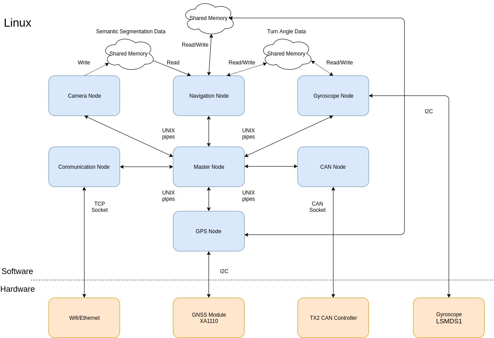

# TX2_Nodes
This repository contains the software for both the tx2 software system, as well as the program used 
to control the rover. 

Though not pictured in the above image, please note that controller.c/logWriter.c both interface 
exclusively with the TX2 communication node.

## TX2 Node Build Instructions
To build the tx2 nodes, you will need to have nvcc installed, as well as the jetson-inference 
library. The repository, as well as installation instructions, can be found at the following link.

https://github.com/dusty-nv/jetson-inference

To build the tx2 nodes, navigate to the parent directory, TX2_Nodes, and type the following command

$ make

You will see the compilation output of the various nodes in the system, there should be no errors. 
You will also need to build the controller application on PC you wish to run the controller on. 
To build just the controller, use the command

$ make controller

You'll see output during compilation, you should see no errors.

## How to Run
On the TX2, or whatever you are running the TX2 nodes on, navigate to the build directory after 
running the make command, and type in the following command.

$ sudo ./tx2_master

Please note that you need to run tx2_master as root. To load the correct CAN modules, and use I2C, 
the master node needs to be started as root. You will start to see output as the various nodes 
initialize, and error messages will be provided if anything fails during startup. Once the 
communication node has finished starting up it will be waiting for the controller to connect. To 
run controller on the client side machine (not the TX2), type the following command in the termnal.

$ ./controller

Controller does not need to run as root. Controller will also create a child process and have it 
execute the logWriter executable. logWriter simply prints any messages from the TX2 and saves images
to the local machine, sent back from the TX2.

If you do not see a connection message on the TX2, it is either because the devices are on different
networks (need to be on same network!) or the TX2s IP address has changed. The IP address is 
currently hard coded in controller.c. Use ifconfig to find the TX2s ip address, you will need to 
recompile controller. As controller isn't meant to be a permanent solution, this was left as is.

## To Add Additional TX2 Nodes
There are a few things that need to be done to create new TX2 nodes. The first thing that will need
to be modified is the enum NodeName, located in include/Messages.h. The new node will need to be 
included in this list, but it must be before Controller and TX2Master. This enum is used to index 
into an array in master, so be aware of that. From here the rest of the changes are in TX2 master. 

At the top of TX2 master, there are three arrays that need to be added to; ExecuteCommands which has 
the command used to execute the node, ChildNames which will have the name of the new node, and 
ChildIdentifiers which holds the enum from Messages.h. Also note that all three arrays have their
members arranged in the same order in regards to the nodes. This order must be maintained for
proper functionality. The CHILD_COUNT macro will need to be adjusted to account for the new node as
well.

For the new node itself, use any one of the other nodes as a template. You will need to at the very
least include Messages.h as it provides the message passing functionality. The node will need to 
read in the pipes sent from master, call SetupSetAndWait() to initialize pselect() functionality
in the SetAndWait() call, and any other initialization it needs to perform its desired functionality.
